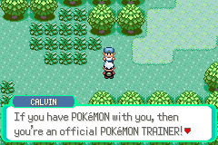

# Pokémon Emerald
### Feature Branch: Name Box

This feature branch implements a name box in the style of the one in my [Trick-or-Treat House](https://www.pokecommunity.com/showthread.php?p=10566982) hack.

Features: 
- Implementation of a name plate attached to the dialog box.
- New command `speakername [textPoionter]` to set the name of the speaker to display in the box.
	- Setting the speaker name to `NULL` hides the name plate.
	- Speaker name is automatically set to `NULL` in the `closemessage` command.
- All trainers capable of trainer sight battles automatically have their trainer name as the speaker name when talking to them or being seen by them.

Notes:
- The message box palette is unchanged. Please change it, as the default colors for the name plate are *not* good.




----

To use this feature branch, [click here](https://github.com/tustin2121/pokeemerald/tree/pick-feature/namebox), then click on the latest commit and manually recreate the changes in your project.

Alternatively, run the following commands to cherry-pick the commit into your repo:

```shell
git fetch https://github.com/tustin2121/pokeemerald.git pick-feature/namebox --no-tags
git cherry-pick FETCH_HEAD
```